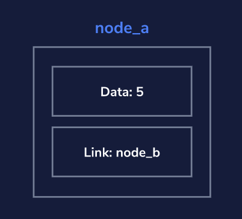
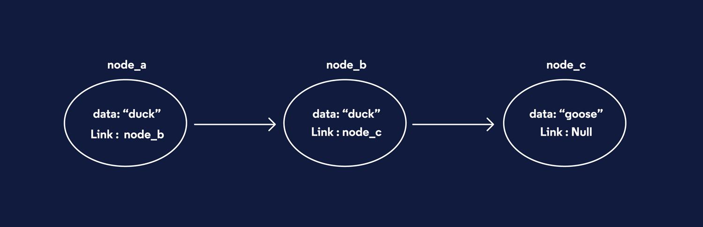
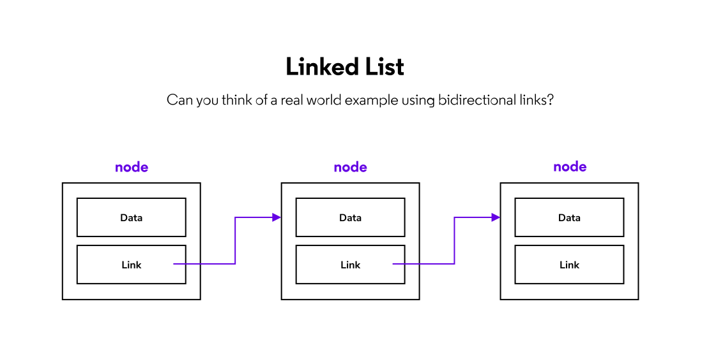
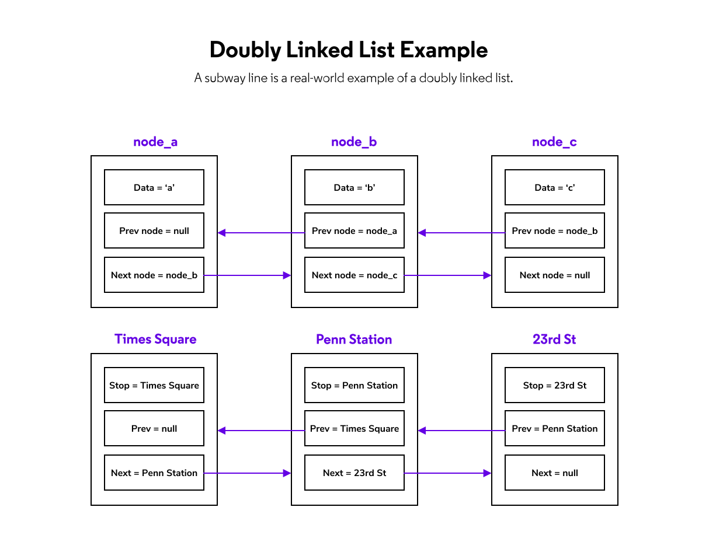

ctrl + k + v
# NODES
A node contains data and links to other nodes.
 - data could be an integer, a string, decimal, an array, or null 
 - links are reffered to as pointers
    - if link is null, it denotes that you've reached the end of the node path

If we want to delete node_b we simply just change the link on node_a to point directly to node_c

```python
class Node:
  def __init__(self, value, link_node=None):
    self.value = value
    self.link_node = link_node
    
  def set_link_node(self, link_node):
    self.link_node = link_node
    
  def get_link_node(self):
    return self.link_node
  
  def get_value(self):
    return self.value

# creating nodes
yacko = Node("likes to yak")
wacko = Node("has a penchant for hoarding snacks")
dot = Node("enjoys spending time in movie lots")

# linking nodes
yacko.set_link_node(dot)
dot.set_link_node(wacko)

# getting data from nodes
dots_data = yacko.get_link_node().get_value()
wackos_data = dot.get_link_node().get_value()
```

# LINKED LIST
When inserting elements into an **array**, the other elements keep being copied and moved around the memory to make space for the new elements which is time and memory consuming. Lists in python are dynamic and they prealocate space even if it's not used later.

Insert/delete element at the bebrginning - O(1)
Insert/delete element at the end - O(n)
Linked list traversal - O(n)
Accessing element by value - O(n)

A linked list is comprised of a series of nodes.
 - Head node is at the beginning
 - Tail node has the link set to null


Linked list operations
 - adding nodes
 - removing nodes
 
 - finding a node
 - traversing the linked list

Two pointer linked list
...
# DOUBLY LINKED LIST
Same as linked list but each node contains data and 2 node links
 - Head node's previous pointer is set to None
 - Tail node's next pointer is set to None


FINISH LATER
# QUEUE
FIFO - first in, first out
`Enqueue` - add data to the end of the queue
`Dequeue` - provides and removes data from the beginning of the queue
`Peek` - reveals data form the front of the queue without removing it

Queues can be implemented using a linked list
# STACK
# HASH MAP
# RECURSION
# ASYMPTOTIC NOTATION
# PATTERN SEARCHING
# SORTING ALGORITHMS
# TREES
## TREE TRAVERSAL
# DIVIDE AND CONQUER
# HEAPS AND HEAPSORT
# GRAPHS AND GRAPH SEARCH
# GREEDY ALGORITHMS
# PATHFINDING ALGORITHMS