ctrl + k + v
# NUMPY
- instead of python lists, we use numpy arrays

```python
import numpy as np

my_array = np.array([1,2,3,4])
my_list = [1,2,3,4]

my_array = np.array(my_list) #converts a list to an array

csv_array = np.genfromtxt('sample.csv', delimiter = ',')
```
## Basic array operations
```python
a = np.array([1,2,3,4,5])
a + 3 #adds 3 to each element ([4,5,6,7,8])
b = np.array([5,4,3,2,1])
a + b #([6,6,6,6,6])
```

## 1-D array selectors
```python
a = np.array([5,2,7,0,11])
a[0] #5
a[-1] #11
a[1:3] #([2,7]) [inclusive, exclusive]
a[:3] #([5,2,7])
a[-3:] #([7,0,11])
```

## 2-D array selectors
```python
a = np.array([[1,2,3,4],
            [10,20,30,40],
            [15,9,24,35]])

#a[row, column]
a[:,0] #selects the first column
a[1,:] #selects the second row
a[0,0:3] #selects first three elements of the first row
```

## Logical operations
```python
a > 5 #returns an array of booleans
a[a>5] #returns all elements that are greater than 5
a[(a>5) | (a<2)] #returns all elements within range
# | , &
```

## Statistics
- sum
```python
survey_responses = ['Ceballos', 'Kerrigan', 'Ceballos', 'Ceballos', 'Ceballos','Kerrigan', 'Kerrigan', 'Ceballos', 'Ceballos', 'Ceballos', 
'Kerrigan', 'Kerrigan', 'Ceballos', 'Ceballos', 'Kerrigan', 'Kerrigan', 'Ceballos', 'Ceballos', 'Kerrigan', 'Kerrigan', 'Kerrigan', 'Kerrigan', 'Kerrigan', 'Kerrigan', 'Ceballos', 'Ceballos', 'Ceballos', 'Ceballos', 'Ceballos', 'Ceballos',
'Kerrigan', 'Kerrigan', 'Ceballos', 'Ceballos', 'Ceballos', 'Kerrigan', 'Kerrigan', 'Ceballos', 'Ceballos', 'Kerrigan', 'Kerrigan', 'Ceballos', 'Ceballos', 'Kerrigan', 'Kerrigan', 'Kerrigan', 'Kerrigan', 'Kerrigan', 'Kerrigan', 'Ceballos',
'Kerrigan', 'Kerrigan', 'Ceballos', 'Ceballos', 'Ceballos', 'Kerrigan', 'Kerrigan', 'Ceballos', 'Ceballos', 'Kerrigan', 'Kerrigan', 'Ceballos', 'Ceballos', 'Kerrigan', 'Kerrigan', 'Kerrigan', 'Kerrigan', 'Kerrigan', 'Kerrigan', 'Ceballos']

total_ceballos = sum([1 for n in survey_responses if n == "Ceballos"])
print(total_ceballos)

>>> 33
```
- mean
```python
np.mean(array)
np.mean(array > 8) #0.2 (20% are greater than 8)
np.mean(2Darray) #mean of all axis
np.mean(2Darray, axis = 1) #mean of all rows
np.mean(2Darray, axis = 0) #mean of all columns
```
- outliers are identified by sorting the data with `np.sort(array)`
- median (middle value of the dataset or the mean of 2 central values)
    - `np.median(array)`
- percentiles
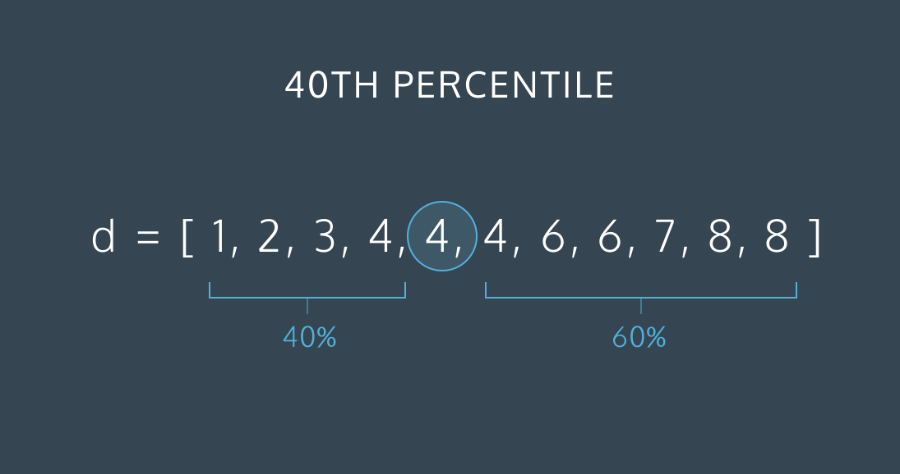
    - `np.percentile(array, percentile)`
- standard deviation 
    - the larger the deviation the more spread out our data are from the center
    - `np.std(array)`

### Statistical distributions
- Histograms
    - individual columns are called bins
    ```python
    from matplotlib import pyplot as plt
    data = np.array([1, 1, 1, 2, 2, 2, 2, 2, 3, 3, 4, 4, 4, 4, 5])
    plt.hist(data, bins=1, range=(2,6)) #inclusive and exculsive
    plt.show()
    ```
    - classifing histograms based on the number of peaks
    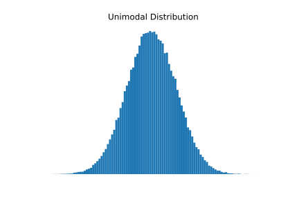
    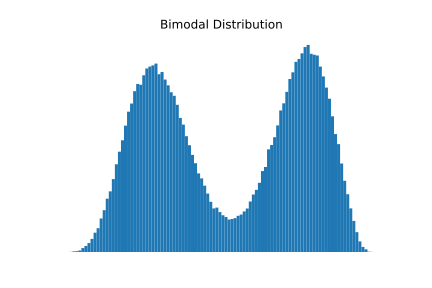
    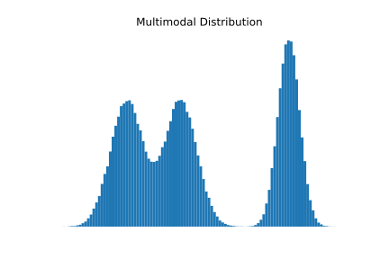
    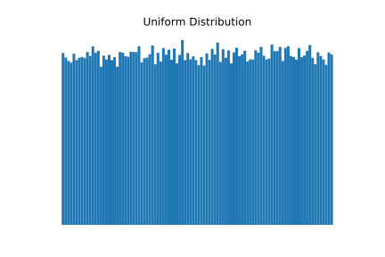
    - calssifing unimodal histogram by data distribution
    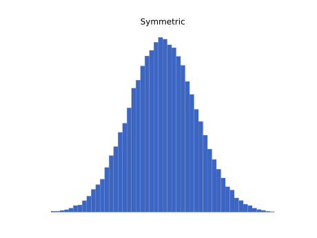
    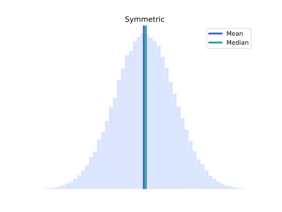
    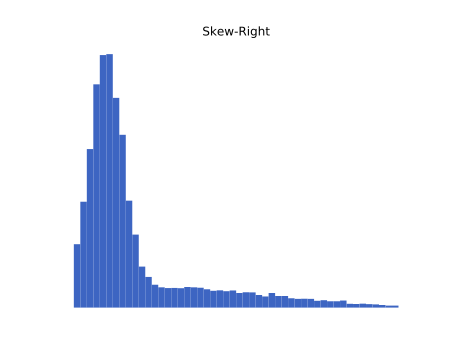
    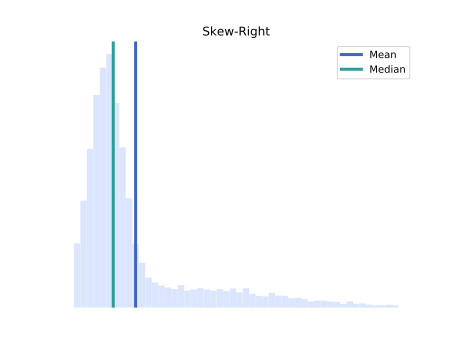
    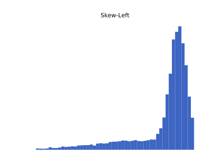
    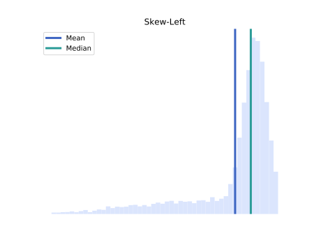
- Normal distribution
    - `np.random.normal(loc, scale, size)`
        - loc - mean for the normal distribution
        - scale - standard deviation of the distribution
        - size - number of random numbers to generate
- Data distribution
    - 68% of our samples will fall between +/- 1 standard deviation of the mean
    - 95% of our samples will fall between +/- 2 standard deviations of the mean
    - 99.7% of our samples will fall between +/- 3 standard deviations of the mean
- Binomial distribution
    - `np.random.binomial(N, P, size)`
        - N - number of samples
        - P - probability of success
        - size - number of experiments
        ```python
        # Let's generate 10,000 "experiments"
        # N = 10 shots
        # P = 0.30 (30% he'll get a free throw)

        a = np.random.binomial(10, 0.30, size=10000)

        plt.hist(a, range=(0, 10), bins=10, normed=True)
        plt.xlabel('Number of "Free Throws"')
        plt.ylabel('Frequency')
        plt.show()
        ```

        ```python
        #calculating the percantage chance of a player scooring 4 shots out of 10
        a = np.random.binomial(10, 0.30, size=10000)
        np.mean(a == 4)

        >>> 0.1973
        ```

## Matplotlib
pandas - library designed for data analysis
```python
from matplotlib import pyplot as plt
import pandas as pd
%matplotlib inline

data = pd.read_csv("PATH") #load CSV with pandas
```
**Charts**
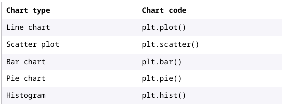
- Line chart - shows continuous change, often used to measure change over time
- Scatter plot - uses position to show the relationship, or correlation, between two numeric values
- Bar chart - uses bar height to compare a measure between categorical variables
- Pie chart - shows us the breakdown of a whole into its parts
- Histogram - shows how one kind of data is distributed

**General functions**
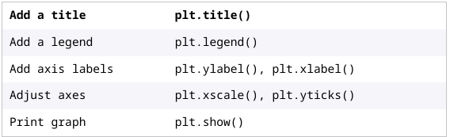
### Line chart
```python
plt.plot(x, y) #we can use direct data, arrays or dataframes

line_data = pd.read_csv('2020-monthly-avg-temps-f.csv')
line_data.head() #shows the firts 5 rows
plt.plot(line_data.month_name, line_data.windhoek_avg_high, color="#FF0000")
plt.plot(line_data.month_name, line_data.kodiak_avg_high, color="blue")
plt.show()
```
- `linewidth` - changes the thickness of the line
- `linestyle` - dotted, dashed, solid

```python
plt.title("Adding title and legend")
plt.plot(x, y, color='red', label='Line Y')
plt.plot(x, z, color='green', label='Line Z')
plt.legend(bbox_to_anchor=(1,0.5)) #positions the legend
# x-axis 0 is left and 1 is right
# y-axis 0 is bottom and 1 is top
plt.xlabel("axis x")
plt.ylabel("axis y")
plt.tick_params(axis='x', direction='out', color='red' labelsize='large', labelcolor='purple', labelrotation=30)
# adjusts the ticks of each axis(overlaping)
plt.show()
```
**Export a chart**
```python
plt.savefig("chart_name.png", dpi=128, bbox_inches="tight")
```
### Bar chart
- `plt.bar()`
    - x : categorical data for each bar
    - height : numeric data to determin height of eachbar
    - width : a number to set the width of each bar
    - align : set to `center` or `edge` to align each bar on the x-axis
```python
plt.bar(x = data.business_name, height = data.profit, width = 0.8, align = 'center')
plt.title("Profits at 5 Businesses, 2021")
plt.xlabel("Business Name")
plt.ylabel("Profit ($)")
plt.show()
```
**Show two bar charts in one figure**
```python
plt.bar(x=avg_heights.family, height=avg_heights.trunk)
plt.bar(x=avg_heights.family, height=avg_heights.leaves, bottom=avg_heights.trunk)
plt.show()
```

### Error bars
- `plt.errorbar(x, y, yerr, color, fmt)`
    - `x` and `y` restate the x and y values of the underlying graph
    - `yerr` and/or `xerr` set error values in the x or y direction
    - `color`
    - `fmt` change the marker
```python
plt.bar(x = bar_data.PH, height = bar_data.average_leaf_width, width = 0.8, align = 'center')
plt.title('Effect of pH on Leaf Width')
plt.xlabel('pH')
plt.ylabel('Leaf Width (cm)')
plt.errorbar(x=bar_data.PH, y=bar_data.average_leaf_width, yerr=bar_data.error, fmt="o", color="orangered")
plt.show()
```

### Scatterplot
positive correlation - if x increases and y also increases
negative correlation - if x increases and y decreases
no corelation - if x increases and y remains constant
- `plt.scatter(x, y, color, alpha)`
    - `x` and `y` are continuous numeric variables we are comparing
    - `color`
    - `alpha`
```python
plt.scatter(scatter_data.danceability, scatter_data.valence, alpha = 0.15, color = "teal")
plt.title('Mood and Danceability correlation in Spotify genres')
plt.xlabel('Danceability')
plt.ylabel('Valence / Mood (sadder to happier)')
plt.show()
```
### View in subplots
- `plt.subplot(num_rows, num_columns, index)`
    - `num_rows`: number of rows in the grid
    - `num_columns`: number of columns in the grid
    - `index`: the numbered position of the subplot, reading the grid from left-to-right, top-to-bottom
- `plt.suptitle()` adds a single title to the top
- `plt.title()` adds a title to every plot
```python
plt.suptitle('Rainbow Scatterplots')
plt.subplot(2, 3, 1)
plt.scatter(x, y, color = red)
plt.subplot(2, 3, 2)
plt.scatter(x, y, color = orange)
plt.subplot(2, 3, 3)
plt.scatter(x, y, color = yellow)
plt.subplot(2, 3, 4)
plt.scatter(x, y, color = green)
plt.subplot(2, 3, 5)
plt.scatter(x, y, color = blue)
plt.subplot(2, 3, 6)
plt.scatter(x, y, color = purple)
```
```python
fig = plt.figure(figsize=(18,16), facecolor='lightgray', tight_layout=True) 
fig.subplots_adjust(hspace=.6)
fig.suptitle('Species Counts in Primary, Secondary, and Selectively Logged Tapajos Forests', fontsize=20, y=1)
plt.subplot(3,1,1)
plt.bar(PF_data.genus, PF_data.counts, color=PF_data.color_label)
plt.xlabel('Primary Forest')
plt.ylim((0,105))
plt.xlim((-3,105))
plt.xticks(rotation=-90, fontsize=13)
plt.subplot(3,1,2)
plt.bar(SF_data.genus, SF_data.counts, color=SF_data.color_label)
plt.xlabel('Secondary Forest')
plt.ylim((0,105))
plt.xlim((-3,105))
plt.xticks(rotation=-90, fontsize=13)
plt.subplot(3,1,3)
plt.bar(SLF_data.genus, SLF_data.counts, color=SLF_data.color_label)
plt.xlabel('Selectively Logged Forest')
plt.ylim((0,105))
plt.xlim((-3,105))
plt.xticks(rotation=-90, fontsize=13)
plt.show()
```
- `plt.xlim()`: specifies the range on the x-axis
- `plt.ylim()`: specifies the range in the y-axis
- `plt.xticks(ha, rotation)`: adjusts the x-axis labels
    - `ha`: horizontal alignment (left,right,center)
    - `rotation`: number

- `fig = plt.figure(figsize, tight_layout, facecolor)`
    - `figsize`: adjusts the dimensions of the figure
    - `tight_layout`: adjusts the spacing of plots for an automated “best fit” with a Boolean
    - `facecolor`: sets the background color
    ```python
    fig = plt.figure(figsize = (10, 4), tight_layout = True, facecolor=’lightgray’)
    ```
- `fig`: this instance has its own methods
    - `suptitle()`: adds a centered title at the top of all subplots, with font size and spacing parameters
    - `supxlabel()`: adds an xlabel to all plots
    - `supylabel()`: adds a ylabel to all plots
    - `subplots_adjust(hspace, wspace)`: manually adjusts spacing around plots
    ```python
    fig.suptitle(‘Six line graphs’, fontsize=24, x=0.45, y=0.95)
    fig.supxlabel(‘Time’)
    fig.subplots_adjust(hspace = 0.5, wspace = 0.25)
    ```
```python
fig = plt.figure(figsize=(18,16), facecolor='lightgray', tight_layout=True) 
fig.subplots_adjust(hspace=.6)
fig.suptitle('Species Counts in Primary, Secondary, and Selectively Logged Tapajos Forests', fontsize=22, y=1)
plt.subplot(3,1,1)
plt.bar(PF_data.genus, PF_data.counts, color=PF_data.color_label)
plt.annotate("Primary Forest", (95,80), fontsize=18, ha="right", backgroundcolor="lightgray")
plt.ylim((0,105))
plt.xlim((-3,105))
plt.xticks(rotation=-90, fontsize=12)
plt.subplot(3,1,2)
plt.bar(SF_data.genus, SF_data.counts, color=SF_data.color_label)
plt.annotate("Secondary Forest", (95,80), fontsize=18, ha="right", backgroundcolor="lightgray")
plt.ylim((0,105))
plt.xlim((-3,105))
plt.xticks(rotation=-90, fontsize=12)
plt.subplot(3,1,3)
plt.bar(SLF_data.genus, SLF_data.counts, color=SLF_data.color_label)
plt.annotate("Selectively Logged Forest", (95,80), fontsize=18, ha="right", backgroundcolor="lightgray")
plt.ylim((0,105))
plt.xlim((-3,105))
plt.xticks(rotation=-90, fontsize=12)
plt.show()
```
- `plt.annotate(text, (xy))`
    - `text`
    - `(xy)`
    - `fontsize` and `color`
    - `ha` and `va` to set horizontal and vertical alignment
    - `backgroundcolor`
    - `arrowprops` to style an arrow from the annotation to a point
    - `xytext` to reposition the text, if an arrow is used – the arrowhead will automatically be positioned at (xy)
    ```python
    plt.annotate('Look at this point!', xy=(15, 35), xytext=(17, 40), fontsize=14, color='blue', arrowprops=dict(arrowstyle= '-|-|>', color='blue'))
    ```
### Pie chart
- `plt.pie(x, labels, startangle, colors)`
    - `x`: the numeric variable shown as pieces of the pie. The function adds up all the x values to compare part and whole and auto-generate the pieces of the pie.
    - `labels`: the variable used to label each section of the pie chart
    - `startangle`: the rotation of the pie chart, adjusted to improve readability
    - `colors`: an array of colors the chart will cycle through. If blank, defaults to matplotlib’s default 10-color “Tableau” palette.
```python
plt.pie(x = data.donut_vote_count, labels = data.donut_flavor, startangle = 30, colors = ['brown', 'pink', 'purple', 'white', 'red'])
```

### Histogram
- `plt.hist(x, bins, range, color)`
    - `x`: the value being distributed (like shoe size, or height) – note that it should not be an aggregated value
    - `bins`: specifies how many bins to make (e.g. 10) OR where the edges of the bins are (as a list of values)
    - `range`: the lower and upper range of the bins. If unspecified, set to the min and max values for x
    - `color`: sets the color of the bars
```python
plt.hist(x = df.shoe_size, bins = 12, range = (5, 12), color = 'dodgerblue')
```

### AB lines
- it's a straight line added to a graph from point A to point B
- `plt.axhline(y, xmin, xmax, linewidth, dashes, color)`: makes a horizontal AB line
- `plt.axvline(x, ymin, ymax, linewidth, dashes, color)`: makes a vertical AB line
    - `x`: where to position the line along the x-axis
    - `ymin`: how close to the bottom of the graph the line starts. Setting ymin=0 starts the line at the bottom of the graph, ymin=.5 would start it halfway up, and ymin=1 would start at the top of the graph. Usually set to 0
    - `ymax`: how close to the bottom of the graph the line ends. Setting ymax=0 ends the line at the bottom of the graph, ymax=.5 would end it halfway up, and ymax=1 would end at the top of the graph. Usually set to 1
    - `linewidth`: line width of the AB line
    - `dashes`: dash pattern given as (line_length, space_length)
    - `color`: color of the AB line
```python
plt.bar( x = school_subject, y = test_score)
plt.axhline(y = 85, xmin = 0, xmax = 1, linewidth = 2, color = red)
```
- `plt.annotate(text, xy, color)`: allows us to position and format text on a graph
    - `text`: annotation text
    - `xy`: (x, y) coordinate position for annotation
    - `color`: color of annotation text and arrow
```python
plt.hist(hist_data.carapace_length, bins=30, range=(75,155), color='gold')
plt.title('Lobsters tagged by size')
plt.ylabel('Number tagged')
plt.xlabel('Carapace length (mm)')

plt.axvline(x=83, ymin=0, ymax=1, linewidth=2, dashes=(1,2), color='mediumblue')
plt.axvline(x=127, ymin=0, ymax=1, linewidth=2, dashes=(1,2), color='mediumblue')
plt.annotate('Minimum legal catch size', (84, 23), color='mediumblue')
plt.annotate('Maximum legal \n catch size', (128, 7), color='mediumblue')

plt.show()
```